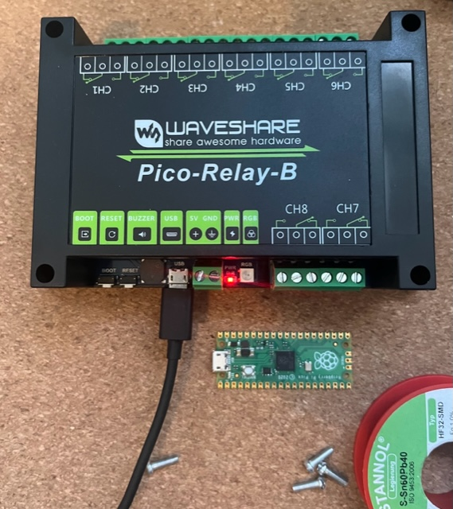

# Controlling Relays from Go


[](https://github.com/nornforge/norn)
[](https://pkg.go.dev/github.com/nornforge/norn)
[](https://opensource.org/licenses/Apache-2.0)


This pure Go implementation allows one to control the outputs off the [Waveshare Pico Relay B](https://www.waveshare.com/wiki/Pico-Relay-B)



## Intro

Sometimes control is needed. This project aims to provide control over the eight relays attached to the Raspberry Pi Pico µC. The project is split into two parts one part is the firmware and the other one is the command line client to set the state from a connected host device.


## Firmware

The firmware can be found in the separate [firmware](https://github.com/nornforge/firmware) repository.

## CLI

```
$ go build -o norn ./cmd/norn-cli.go
```

## REST API v1

The CLI can also server the Relays over an REST API, to control the output the easiest way is to use the `curl` command line utility. The purpose of this interface is to be compatible with [labgrid's](https://github.com/labgrid-project/labgrid/blob/master/labgrid/driver/power/rest.py) REST API.

```
Rest interface for controlling power port, using PUT / GET on a URL.

  NetworkPowerPort:
      model: rest
      host: 'http://192.168.0.42/relay/{index}/value'
      index: 3

  Will do a GET request to http://192.168.0.42/relay/3/value to get current
  relay state, expecting a response of either '0' (relay off) or '1' (relay
  on), and a PUT request to http://192.168.0.42/relay/3/value with request
  data of '0' or '1' to change relay state.
```

### PUT request

To turn off the output number `8` use the following command

```sh
curl -i -X PUT -d 0 http://127.0.0.1:8080/api/v1/relay/8/value
```

The command line option `-i` is to print out the http response, the parameter `-X PUT` is used to send a `PUT` request. The option `-d 0` is used to set the output to `off` use `-d 1` to set the output to the `on` state.

### GET request

In case one wants to read the current value of the output a `GET` request is used

```sh
curl -i http://127.0.0.1:8080/api/v1/relay/8/value
```

### URL structure

There are only a few elements which are dynamic within the URL: `http://<hostname>:<port>/api/v1/relay/<channel>/value`

- **hostname or ip**, Which the server binds to
- **port**, The TCP port the service is listening to
- **channel**, The relay channel to read from or to manipulate

## REST API v2

The API version 2 serves as a JSON API. Currently there is only support for information query. The returned JSON is pretty self explaining

```sh
curl -s http://127.0.0.1:8080/api/v2/info | jq
{
  "server": {
    "version": {
      "major": 2,
      "minor": 0,
      "patch": 1
    }
  },
  "device": {
    "version": {
      "major": 1,
      "minor": 2,
      "patch": 0
    }
  },
  "channels": {
    "min": 1,
    "max": 8
  }
}
```
The curl command line option `-s` is to suppress the download status information. We also pipe the output to jq for a better readability.


## Systemd activation

In case you are satisfied with the results you can run the `norn` server as a systemd service. The details are described in the [docs](doc/systemd.md)

## License

This software is licensed under the [Apache License Version 2.0](LICENSE)